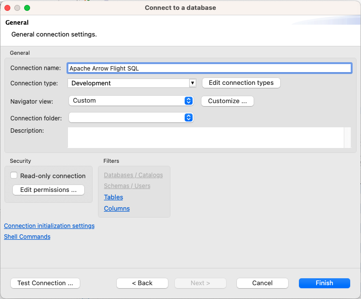

# How to set up DBeaver Community Edition (on MacOS) to use the Apache Arrow Flight SQL JDBC Driver

[](https://hub.docker.com/r/voltrondata/flight-sql)
[](https://github.com/voltrondata/flight-sql-server-example)
[](https://search.maven.org/search?q=a:flight-sql-jdbc-driver)

## Here are the steps:   

1. Make sure you have access to a running Flight SQL server - you can use [this repo](https://github.com/voltrondata/flight-sql-server-example) to easily start one if you do not have one running.


2. Download DBeaver Community Edition if you haven't already - [here](https://dbeaver.io)  


3. Download the Apache Arrow Flight SQL JDBC driver - [here](https://search.maven.org/search?q=a:flight-sql-jdbc-driver) - choose the "jar" option.     


4. Launch DBeaver  


5. In the DBeaver application menu bar, open the "Database" menu and choose: "Driver Manager":      
   


6. Click the "New" button on the right:     
   


7. Add the JDBC jar file:  
   1. Click the "Libraries" tab  
   1. Click the: "Add File" button   
   1. Choose the "flight-sql-jdbc-driver-11.0.0.jar" jar file (the file downloaded in step 3 above) - and click "Open"   
      
   1. Close the Driver editor window with the blue "OK" button on the lower-right   


8. Enter the driver settings:   
   1. Click the "Settings" tab   
   1. In the "Driver Name" field - enter: ```Apache Arrow Flight SQL```   
   1. In the "URL Template" field - enter: ```jdbc:arrow-flight-sql://{host}:{port}?useEncryption=true&disableCertificateVerification=true```   
   1. In the "Driver Type" drop-down box - choose: "SQLite"   
   1. Your driver manager "Edit Driver" window should look like this:   
      
   1. Click the blue "OK" button on the lower-right to save the driver   
   1. Close the "Driver Manager" window by clicking the blue "Close" button on the lower-right.

   
9. Create a new Database Connection:   
   1. In the DBeaver application menu bar, open the "Database" menu and choose: "New Database Connection":   
      
   1. In the "Connect to a database" window - type: ```Flight``` in the search bar   
   1. Choose the ```Apache Arrow Flight SQL``` driver - your window should look like this:   
      
   1. Click the blue "Next >" button on the bottom of the window
   1. On the next screen, the JDBC URL should be filled out already - just supply the Host (`localhost`), Port (`31337`), Username (`flight_username`), and Password values for your running Flight SQL server.  Your window should look like this:   
   
   1. Click the "Test Connection" button - your window should look like this:   
      
   1. Click the blue "OK" button to close the Connection test window
   1. Click the "Connection details (name, type, ...)" button on the right
   1. In the "General" section, enter: `Apache Arrow Flight SQL` for the "Connection name".  It should look like this:
   
   1. Click the blue "Finish" button to save the connection   


10. Run a query:
    1. Right-click on the Database Connection on the left - choose: "SQL Editor", and then: "Open SQL Console" as shown here:      
       
    1. In the Console window - run a query - something like: ```SELECT * FROM customer;```   
    1. Click the triangle button to execute the SQL statement - as shown below (or use keyboard shortcut: Ctrl+Enter):      
       
    1. You should see the query results as shown in this screenshot:   
       


## Congrats - you are all done!
